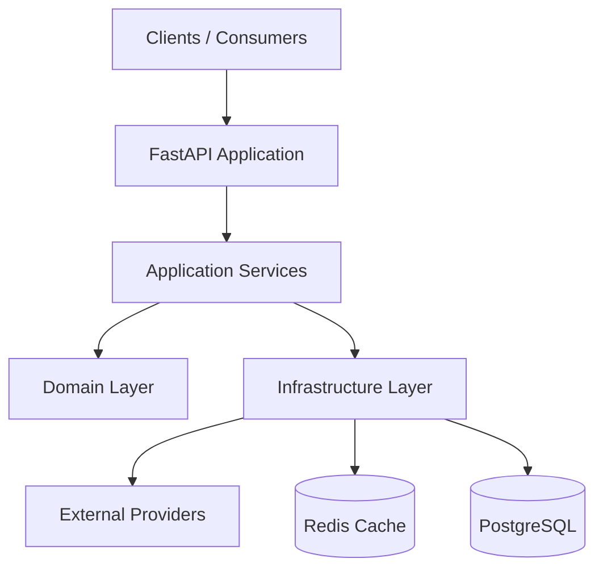
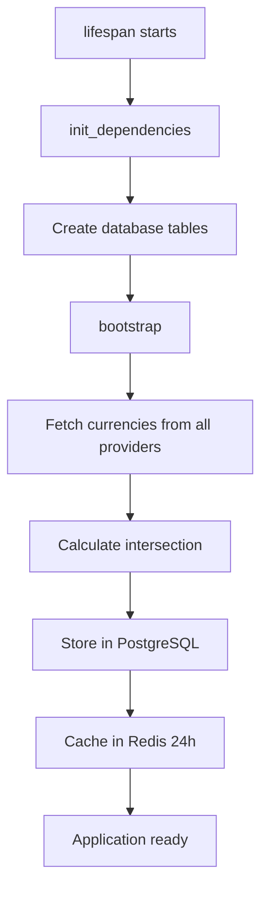

The Currency Converter API is built with a clean, maintainable architecture that separates concerns across four distinct layers. This design ensures reliability, testability, and flexibility.

## System overview

The API aggregates exchange rates from three external providers (Fixer.io, OpenExchangeRates, and CurrencyAPI), averages them for accuracy, caches results in Redis, and persists history in PostgreSQL.



## 4-layer architecture

The project follows a strict layered architecture where each layer only depends on the layer directly below it:

<CodeGroup>
```text Directory Structure
api/              ← Layer 1: HTTP interface
application/      ← Layer 2: Business logic & orchestration
domain/           ← Layer 3: Core entities & exceptions
infrastructure/   ← Layer 4: External systems (DB, cache, APIs)
```

```python Dependency Rules
# api/ imports from application/ only
from application.services import ConversionService

# application/ imports from domain/ and infrastructure/
from domain.models.currency import ExchangeRate
from infrastructure.cache.redis_cache import RedisCacheService

# domain/ imports nothing from other project layers (pure Python)
# infrastructure/ imports from domain/ only
from domain.exceptions.currency import ProviderError
```
</CodeGroup>

<Note>
This means changing how Redis stores data never touches business logic. Swapping a currency provider only requires changes in `infrastructure/providers/`.
</Note>

### Layer 1: API layer

Handles HTTP concerns only—no business logic lives here.

| File | Responsibility |
|------|----------------|
| `main.py` | FastAPI app creation, lifespan startup/shutdown |
| `routes/currency.py` | HTTP endpoints, path parameter parsing |
| `schemas/requests.py` | Pydantic input validation |
| `schemas/responses.py` | Pydantic response shaping |
| `dependencies.py` | Dependency injection wiring |
| `error_handlers.py` | Maps domain exceptions to HTTP status codes |

<CodeGroup>
```python api/routes/currency.py
@router.get(
    '/convert/{from_currency}/{to_currency}/{amount}',
    response_model=ConversionResponse,
    status_code=status.HTTP_200_OK,
)
async def convert_currency(
    from_currency: Annotated[str, Path(min_length=3, max_length=5)],
    to_currency: Annotated[str, Path(min_length=3, max_length=5)],
    amount: Annotated[Decimal, Path(gt=0, decimal_places=2)],
    service: Annotated[ConversionService, Depends(get_conversion_service)],
) -> ConversionResponse:
    from_currency = from_currency.upper()
    to_currency = to_currency.upper()
    result = await service.convert(amount, from_currency, to_currency)
    return ConversionResponse(**result)
```

```python api/main.py
@asynccontextmanager
async def lifespan(app: FastAPI):
    logger.info('Starting Currency Converter API...')
    
    init_dependencies()
    
    deps.db = Database(settings.DATABASE_URL)
    await deps.db.create_tables()
    logger.info('Database tables created')
    
    await bootstrap()
    logger.info('Application ready')
    
    yield
    
    logger.info('Shutting down...')
    await cleanup_dependencies()

app = FastAPI(title=settings.APP_NAME, lifespan=lifespan)
```
</CodeGroup>

### Layer 2: Application layer

Orchestrates business logic by coordinating between domain models and infrastructure.

| Service | Responsibility |
|---------|----------------|
| `CurrencyService` | Managing supported currencies, validating currency codes |
| `RateService` | Fetching, aggregating, and caching exchange rates |
| `ConversionService` | Orchestrating end-to-end currency conversion |

```python application/services/conversion_service.py
class ConversionService:
    def __init__(self, rate_service: RateService, currency_service: CurrencyService):
        self.rate_service = rate_service
        self.currency_service = currency_service

    async def convert(self, amount: Decimal, from_currency: str, to_currency: str) -> dict:
        await self.currency_service.validate_currency(from_currency)
        await self.currency_service.validate_currency(to_currency)
        
        rate = await self.rate_service.get_rate(from_currency, to_currency)
        converted_amount = amount * rate.rate
        
        return {
            'from_currency': from_currency,
            'to_currency': to_currency,
            'original_amount': amount,
            'converted_amount': converted_amount,
            'exchange_rate': rate.rate,
            'timestamp': rate.timestamp,
            'source': rate.source,
        }
```

### Layer 3: Domain layer

Completely framework-free—just pure Python dataclasses and exceptions.

| Module | Responsibility |
|--------|----------------|
| `models/currency.py` | Frozen dataclasses: `ExchangeRate`, `SupportedCurrency`, `AggregatedRate` |
| `exceptions/currency.py` | Typed exceptions: `InvalidCurrencyError`, `ProviderError`, `CacheError` |

<Note>
No FastAPI, SQLAlchemy, or Redis imports here. This makes domain logic trivially testable.
</Note>

### Layer 4: Infrastructure layer

Handles all external dependencies and I/O operations.

| Module | Responsibility |
|--------|----------------|
| `providers/` | HTTP clients for each exchange rate API |
| `cache/redis_cache.py` | Redis read/write with TTL management |
| `persistence/database.py` | SQLAlchemy async engine and session factory |
| `persistence/models/` | ORM table definitions |
| `persistence/repositories/` | All database and cache queries |

## Request flow

Here's what happens when you request a currency conversion:

<Steps>
  <Step title="Request validation">
    Pydantic validates path parameters in the API layer

    ```python
    GET /api/convert/USD/EUR/100
    ```
  </Step>

  <Step title="Currency validation">
    `CurrencyService` validates both currency codes against the supported list (cached in Redis)

    ```python
    await currency_service.validate_currency("USD")
    await currency_service.validate_currency("EUR")
    ```
  </Step>

  <Step title="Cache check">
    `RateService` checks Redis for a recent rate (within 5 minutes)

    ```python
    rate = await redis.get("rate:USD:EUR")
    ```

    If cache HIT → skip to step 6
  </Step>

  <Step title="Parallel provider fetch">
    If cache MISS → fetch from all three providers simultaneously

    ```python
    results = await asyncio.gather(
        fixerio.fetch_rate("USD", "EUR"),
        openexchange.fetch_rate("USD", "EUR"),
        currencyapi.fetch_rate("USD", "EUR"),
        return_exceptions=True
    )
    # Example results:
    # [Decimal('0.9250'), Decimal('0.9260'), ProviderError(...)]
    ```
  </Step>

  <Step title="Rate aggregation">
    Average successful responses, tolerating partial failures

    ```python
    valid_rates = [r for r in results if isinstance(r, Decimal)]
    averaged_rate = sum(valid_rates) / len(valid_rates)
    # (0.9250 + 0.9260) / 2 = 0.9255
    ```
  </Step>

  <Step title="Cache and persist">
    Store the rate in both Redis (temporary) and PostgreSQL (permanent)

    ```python
    await redis.set("rate:USD:EUR", json_data, ex=300)  # 5 min TTL
    await db.insert_rate_history(rate_data)
    ```
  </Step>

  <Step title="Calculate and return">
    Perform the conversion and return the response

    ```python
    converted_amount = 100 × 0.9255 = 92.55
    return ConversionResponse(...)
    ```
  </Step>
</Steps>

<Note>
Subsequent requests for USD/EUR within 5 minutes skip steps 4-5 entirely, requiring zero external API calls.
</Note>

## Infrastructure components

### Redis caching

Redis stores rates and supported currencies with different TTLs:

```python
# Key schema
rate:{from}:{to}       → ExchangeRate as JSON  (TTL: 5 minutes)
currencies:supported   → list[str] as JSON     (TTL: 24 hours)
```

<CodeGroup>
```python Cache Write
# Storing a rate
data = {
    "from_currency": "USD",
    "to_currency": "EUR",
    "rate": "0.9255",  # Decimal serialized as string
    "timestamp": "2026-03-04T14:30:00Z",
    "source": "averaged"
}
await redis.set("rate:USD:EUR", json.dumps(data), ex=300)
```

```python Cache Read
# Retrieving a rate
raw = await redis.get("rate:USD:EUR")
if raw:
    data = json.loads(raw)
    rate = Decimal(data["rate"])  # String → Decimal
```
</CodeGroup>

<Warning>
`Decimal` values are always serialized as strings to preserve precision. Never serialize floats directly.
</Warning>

### PostgreSQL schema

Two tables store currency metadata and historical rates:

```sql
CREATE TABLE supported_currencies (
    code  VARCHAR(5)   PRIMARY KEY,
    name  VARCHAR(100) NULLABLE
);

CREATE TABLE rate_history (
    id            SERIAL PRIMARY KEY,
    from_currency VARCHAR(5)    NOT NULL,
    to_currency   VARCHAR(5)    NOT NULL,
    rate          DECIMAL(18,6) NOT NULL,
    timestamp     TIMESTAMP     NOT NULL,
    source        VARCHAR(50)   NOT NULL,
    UNIQUE(from_currency, to_currency, timestamp)
);

CREATE INDEX idx_rate_history_from ON rate_history(from_currency);
CREATE INDEX idx_rate_history_to ON rate_history(to_currency);
CREATE INDEX idx_rate_history_timestamp ON rate_history(timestamp);
```

### Provider interface

All providers implement a common protocol (interface):

```python infrastructure/providers/base.py
class ExchangeRateProvider(Protocol):
    @property
    def name(self) -> str:
        """Provider identifier (e.g., 'fixerio')"""
        ...
    
    async def fetch_rate(self, from_currency: str, to_currency: str) -> Decimal:
        """Fetch a single exchange rate"""
        ...
    
    async def fetch_supported_currencies(self) -> list[dict]:
        """Return list of supported currencies"""
        ...
    
    async def close(self) -> None:
        """Close HTTP client connections"""
        ...
```

<Note>
Each provider owns its own `httpx.AsyncClient` and translates provider-specific errors into `ProviderError`.
</Note>

## Provider aggregation strategy

### Parallel fetching

All providers are queried simultaneously using `asyncio.gather()`:

```python
┌─────────────┐
│   Request   │
└──────┬──────┘
       │
       ├────────► FixerIO        → 0.9250 ✓
       ├────────► OpenExchange   → 0.9260 ✓
       └────────► CurrencyAPI    → FAIL   ✗
                  │
                  ▼
            avg = (0.9250 + 0.9260) / 2 = 0.9255
```

### Failure tolerance

The system gracefully handles partial failures:

| Scenario | Outcome |
|----------|----------|
| 1-2 providers fail | Average remaining successful responses |
| All 3 providers fail | Raise `ProviderError` → HTTP 503 |
| Cache available | Return cached value, skip providers entirely |

### Retry logic

Providers use `tenacity` for exponential backoff on transient errors:

```python
@retry(
    stop=stop_after_attempt(3),
    wait=wait_exponential(multiplier=1, max=10),
    retry=retry_if_exception_type((ConnectionError, TimeoutError)),
)
async def fetch_rate(self, from_currency: str, to_currency: str) -> Decimal:
    # 3 attempts: 1s → 2s → 4s (max 10s)
    ...
```

<Warning>
Only connection/timeout errors are retried. API-level errors like invalid keys are NOT retried.
</Warning>

## Dependency injection

The application uses FastAPI's dependency injection system:

<CodeGroup>
```python Singleton Dependencies
# Created once at startup, live for app lifetime
deps = AppDependencies()

def init_dependencies():
    deps.db = Database(settings.DATABASE_URL)
    deps.redis_cache = RedisCacheService(redis_client)
    deps.providers = {
        'fixerio': FixerIOProvider(settings.FIXERIO_API_KEY),
        'openexchange': OpenExchangeProvider(settings.OPENEXCHANGE_APP_ID),
        'currencyapi': CurrencyAPIProvider(settings.CURRENCYAPI_KEY),
    }
```

```python Per-Request Dependencies
# Created fresh for each HTTP request
async def get_db_session() -> AsyncSession:
    async with deps.db.session_factory() as session:
        yield session

def get_currency_repository(
    session: AsyncSession = Depends(get_db_session)
) -> CurrencyRepository:
    return CurrencyRepository(session, deps.redis_cache)

def get_conversion_service(
    rate_service: RateService = Depends(get_rate_service)
) -> ConversionService:
    return ConversionService(rate_service, deps.currency_service)
```
</CodeGroup>

<Note>
FastAPI resolves the full dependency graph automatically. Endpoints only declare their immediate dependency.
</Note>

## Error handling

Domain exceptions are mapped to HTTP status codes:

```python api/error_handlers.py
@app.exception_handler(InvalidCurrencyError)
async def invalid_currency_handler(request: Request, exc: InvalidCurrencyError):
    return JSONResponse(
        status_code=400,
        content={"detail": str(exc)}
    )

@app.exception_handler(ProviderError)
async def provider_error_handler(request: Request, exc: ProviderError):
    return JSONResponse(
        status_code=503,
        content={"detail": "Exchange rate service unavailable"}
    )
```

| Domain Exception | HTTP Status | Client Message |
|-----------------|-------------|----------------|
| `InvalidCurrencyError` | 400 Bad Request | "Currency XYZ not supported" |
| `ProviderError` | 503 Service Unavailable | "Exchange rate service unavailable" |
| `Exception` (catch-all) | 500 Internal Server Error | "Internal server error" |

<Warning>
`ProviderError` details are hidden from clients to avoid exposing internal API information.
</Warning>

## Startup sequence

The application initializes in a specific order:



<Note>
If all providers fail during bootstrap, the app raises `ProviderError` and exits—preventing startup with no valid currency data.
</Note>

## Key design decisions

### Why average multiple providers?

Aggregating rates from three sources provides:
- **Reliability**: If one provider is down, others continue serving
- **Accuracy**: Averaging reduces impact of outliers from any single provider
- **Redundancy**: No single point of failure

### Why intersection of supported currencies?

Only currencies supported by **all three providers** are allowed. This ensures:
- Consistent results across all requests
- No partial failures due to unsupported currency pairs
- Simpler error handling logic

### Why 5-minute cache TTL?

Exchange rates don't change drastically within minutes:
- Reduces external API calls by ~95% for popular pairs
- Stays within free tier limits of provider APIs
- Still fresh enough for most use cases
- Can be adjusted via configuration if needed

### Why PostgreSQL for history?

Storing all fetched rates enables:
- Historical analysis and trending
- Auditing of rate sources
- Debugging provider discrepancies
- Potential future features (rate charts, alerts)

## Next steps

Now that you understand the architecture:

- Explore the [API reference](/api-reference/convert) documentation
- Learn about [adding custom providers](/development/adding-providers)
- Review the [architecture layers](/architecture/layers) in detail
- Understand the [caching strategy](/architecture/caching-strategy)