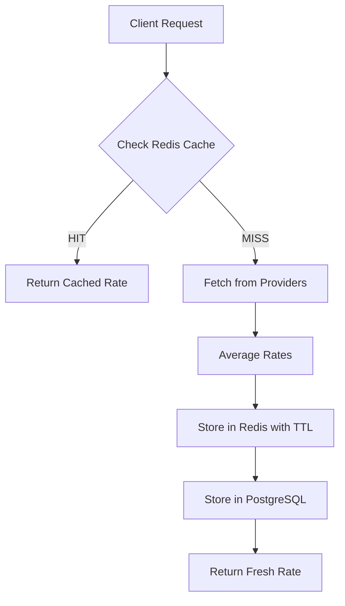

The Currency Converter API uses **Redis** as a high-performance cache to minimize external API calls, reduce response times, and control costs. This page documents the caching patterns, TTL configurations, and cache key design.

## Cache overview

Redis serves as a **write-through cache** for exchange rates and supported currencies:

- **Exchange rates**: Cached for 5 minutes
- **Supported currencies**: Cached for 24 hours
- **Data format**: JSON with `Decimal` serialized as strings for precision

<Info>
  Write-through caching means every fresh fetch immediately populates Redis, so the second request for any pair within the TTL window returns instantly.
</Info>

## Cache key structure

The cache uses a hierarchical key naming scheme for clarity and organization.

From `infrastructure/cache/redis_cache.py:17`:

```python
def _make_rate_key(self, from_currency: str, to_currency: str) -> str:
    return f'rate:{from_currency}:{to_currency}'
```

### Key patterns

| Pattern | Example | Purpose | TTL |
|---------|---------|---------|-----|
| `rate:{from}:{to}` | `rate:USD:EUR` | Exchange rate data | 5 minutes |
| `currencies:supported` | `currencies:supported` | List of currency codes | 24 hours |

<Note>
  Using structured keys (colon-separated namespaces) makes debugging easier and enables pattern-based operations like `KEYS rate:*` in development.
</Note>

## TTL configuration

Time-to-live values are configured in the `RedisCacheService` constructor.

From `infrastructure/cache/redis_cache.py:11`:

```python
class RedisCacheService:
    def __init__(self, redis_client: redis.Redis):
        self.redis = redis_client
        self.rate_ttl = timedelta(minutes=5)
        self.currency_ttl = timedelta(hours=24)
```

### TTL rationale

| Cache Type | TTL | Reasoning |
|------------|-----|------------|
| **Exchange rates** | 5 minutes | Balances freshness with API cost. Most real-world use cases don't require second-level accuracy. |
| **Supported currencies** | 24 hours | Currency lists rarely change. Long TTL reduces database queries and provider API calls. |

<Accordion title="Why 5 minutes for rates?">
  Exchange rates update frequently but not instantly. A 5-minute window provides:
  - **Fresh enough** for most applications (e-commerce, travel booking, reporting)
  - **Cost effective** by limiting API calls to 1 per pair per 5 minutes
  - **Fast responses** for repeated conversions during the cache window

  For high-frequency trading or real-time applications, you can reduce this to 1 minute or implement a separate "real-time" endpoint.
</Accordion>

## Cache operations

### Reading from cache

The `get_rate` method retrieves cached rates and deserializes them into domain objects.

From `infrastructure/cache/redis_cache.py:20`:

```python
async def get_rate(self, from_currency: str, to_currency: str) -> ExchangeRate | None:
    key = self._make_rate_key(from_currency, to_currency)
    data = await self.redis.get(key)

    if not data:
        return None

    try:
        rate_dict = json.loads(data)
        return ExchangeRate(
            from_currency=rate_dict['from_currency'],
            to_currency=rate_dict['to_currency'],
            rate=Decimal(rate_dict['rate']),
            timestamp=datetime.fromisoformat(rate_dict['timestamp']),
            source=rate_dict['source'],
        )
    except json.decoder.JSONDecodeError as e:
        raise CacheError('Invalid json data decoded') from e
```

<Note>
  `Decimal` is serialized as a **string** (not float) to preserve precision. Financial calculations require exact decimal arithmetic.
</Note>

### Writing to cache

The `set_rate` method stores rates with automatic expiration.

From `infrastructure/cache/redis_cache.py:39`:

```python
async def set_rate(self, rate: ExchangeRate) -> None:
    key = self._make_rate_key(rate.from_currency, rate.to_currency)

    rate_dict = {
        'from_currency': rate.from_currency,
        'to_currency': rate.to_currency,
        'rate': str(rate.rate),
        'timestamp': rate.timestamp.isoformat(),
        'source': rate.source,
    }

    await self.redis.setex(key, self.rate_ttl, json.dumps(rate_dict))
```

<Info>
  Using `setex` (SET with EXpiry) atomically sets the value and TTL in a single command, preventing race conditions.
</Info>

### Supported currencies cache

Supported currencies are cached as a JSON array.

From `infrastructure/cache/redis_cache.py:52`:

```python
async def get_supported_currencies(self) -> list[str] | None:
    data = await self.redis.get('currencies:supported')
    if not data:
        return None
    try:
        return json.loads(data)
    except json.decoder.JSONDecodeError as e:
        raise CacheError('Invalid json data decoded') from e

async def set_supported_currencies(self, currencies: list[str]) -> None:
    await self.redis.setex('currencies:supported', self.currency_ttl, json.dumps(currencies))
```

## Cache integration in rate service

The `RateService` checks the cache before fetching from providers.

From `application/services/rate_service.py:30`:

```python
async def get_rate(self, from_currency: str, to_currency: str) -> ExchangeRate:
    await self.currency_service.validate_currency(from_currency)
    await self.currency_service.validate_currency(to_currency)

    cached_rate = await self.repository.cache.get_rate(from_currency, to_currency)
    if cached_rate:
        logger.info(f'Cache HIT: {from_currency}/{to_currency}')
        return cached_rate

    logger.info(f'Cache MISS: {from_currency}/{to_currency}, fetching from providers')

    aggregated = await self._aggregate_rates(from_currency, to_currency)

    rate = ExchangeRate(
        from_currency=aggregated.from_currency,
        to_currency=aggregated.to_currency,
        rate=aggregated.rate,
        timestamp=aggregated.timestamp,
        source='averaged' if len(aggregated.sources) > 1 else aggregated.sources[0],
    )

    await self.repository.save_rate(rate)

    return rate
```

### Cache flow diagram



<Accordion title="Why check cache before validating currency?">
  The validation check itself queries the cache (for supported currencies). By checking rate cache first, you can return immediately if the rate is cached, avoiding even the validation queries.

  However, in this implementation, validation happens first to ensure early error responses for invalid currencies.
</Accordion>

## Cache warming

Supported currencies are cached during application startup to avoid cold-start latency.

From `application/services/currency_service.py:38`:

```python
await self.repository.save_supported_currencies(currency_models)
logger.info(f'Saved {len(supported_codes)} supported currencies.')
```

The repository's `save_supported_currencies` method updates both the database and Redis:

```python
# From repository implementation
await self.cache_service.set_supported_currencies([c.code for c in currencies])
```

<Note>
  This **cache warming** ensures the first requests after deployment are just as fast as subsequent requests.
</Note>

## Data serialization

### Decimal precision

Financial calculations require exact decimal arithmetic. Floating-point numbers introduce rounding errors.

```python
# Correct: Serialize Decimal as string
'rate': str(rate.rate)  # "0.925500"

# Incorrect: Serialize Decimal as float
'rate': float(rate.rate)  # 0.9255000000000001 (precision loss)
```

From `infrastructure/cache/redis_cache.py:45`:

```python
rate_dict = {
    'from_currency': rate.from_currency,
    'to_currency': rate.to_currency,
    'rate': str(rate.rate),  # Preserve precision
    'timestamp': rate.timestamp.isoformat(),
    'source': rate.source,
}
```

### DateTime serialization

Datetimes are stored as ISO 8601 strings for readability and compatibility:

```python
# Serialization
'timestamp': rate.timestamp.isoformat()  # "2026-03-04T15:30:00.123456"

# Deserialization
timestamp=datetime.fromisoformat(rate_dict['timestamp'])
```

## Cache invalidation

The system uses **TTL-based expiration** rather than explicit invalidation:

- No manual cache invalidation needed
- Redis automatically removes expired keys
- Fresh data is fetched transparently on cache miss

<Warning>
  If you need to force a refresh (e.g., after detecting stale data), you can implement a cache flush endpoint, but this is not included by default.
</Warning>

## Error handling

Cache errors are wrapped in domain exceptions and logged.

From `infrastructure/cache/redis_cache.py:36`:

```python
except json.decoder.JSONDecodeError as e:
    raise CacheError('Invalid json data decoded') from e
```

| Error Type | Cause | Handling |
|------------|-------|----------|
| `json.JSONDecodeError` | Corrupted cache data | Raise `CacheError`, log error, treat as cache miss |
| `ConnectionError` | Redis unavailable | Propagate exception, return 503 |
| `TimeoutError` | Slow Redis response | Propagate exception, consider fallback to DB |

<Info>
  Cache errors are **non-fatal** for read operations. If Redis is unavailable, the service can fall back to fetching from providers (at the cost of increased latency).
</Info>

## Performance impact

### Cache hit scenario

```
Request → Redis → Response (< 10ms)
```

No external API calls, no database queries (except initial currency validation).

### Cache miss scenario

```
Request → Redis MISS → Providers (parallel) → Redis SET → DB INSERT → Response (200-500ms)
```

Subsequent requests within 5 minutes hit cache.

### Cache effectiveness metrics

| Metric | Target | Measurement |
|--------|--------|-------------|
| **Hit rate** | > 80% | `cache_hits / total_requests` |
| **Response time (hit)** | < 50ms | P95 latency for cached requests |
| **Response time (miss)** | < 1000ms | P95 latency for provider fetch |

## Configuration best practices

<CardGroup cols={2}>
  <Card title="Production TTL" icon="clock">
    Keep 5-minute default for most use cases. Adjust based on traffic patterns.
  </Card>
  <Card title="Redis memory" icon="memory">
    Monitor memory usage. Each rate is ~200 bytes. Plan capacity accordingly.
  </Card>
  <Card title="Eviction policy" icon="trash">
    Use `allkeys-lru` to automatically remove least-used keys when memory is full.
  </Card>
  <Card title="Persistence" icon="database">
    Enable RDB snapshots for cache recovery after restarts.
  </Card>
</CardGroup>

## Monitoring and observability

Key metrics to track:

```python
# Log cache hits/misses for observability
logger.info(f'Cache HIT: {from_currency}/{to_currency}')
logger.info(f'Cache MISS: {from_currency}/{to_currency}, fetching from providers')
```

Implement metrics collection for:
- Cache hit rate by currency pair
- Average response time (cached vs uncached)
- Redis connection pool statistics
- TTL distribution (how long until expiration)

## Redis configuration

Connection is established at startup from `api/dependencies.py:42`:

```python
deps.redis_client = Redis.from_url(settings.REDIS_URL, decode_responses=True)
deps.redis_cache = RedisCacheService(deps.redis_client)
```

<Note>
  `decode_responses=True` automatically decodes Redis bytes to strings, simplifying JSON parsing.
</Note>

### Recommended Redis settings

```conf
# redis.conf
maxmemory 256mb
maxmemory-policy allkeys-lru
save 900 1
save 300 10
save 60 10000
```

## Troubleshooting

<AccordionGroup>
  <Accordion title="Cache always returns miss">
    - Check Redis connection in application logs
    - Verify `REDIS_URL` environment variable
    - Test Redis connectivity: `redis-cli ping`
    - Check if TTL is set correctly: `redis-cli TTL rate:USD:EUR`
  </Accordion>

  <Accordion title="Stale rates returned">
    - Verify TTL configuration in `RedisCacheService`
    - Check if rates are being written after provider fetch
    - Review logs for cache write errors
    - Manually flush keys: `redis-cli DEL rate:USD:EUR`
  </Accordion>

  <Accordion title="Redis memory growing unbounded">
    - Set `maxmemory` and `maxmemory-policy` in redis.conf
    - Monitor key count: `redis-cli DBSIZE`
    - Check for keys without TTL: `redis-cli KEYS * | xargs redis-cli TTL`
    - Review eviction stats: `redis-cli INFO stats`
  </Accordion>
</AccordionGroup>