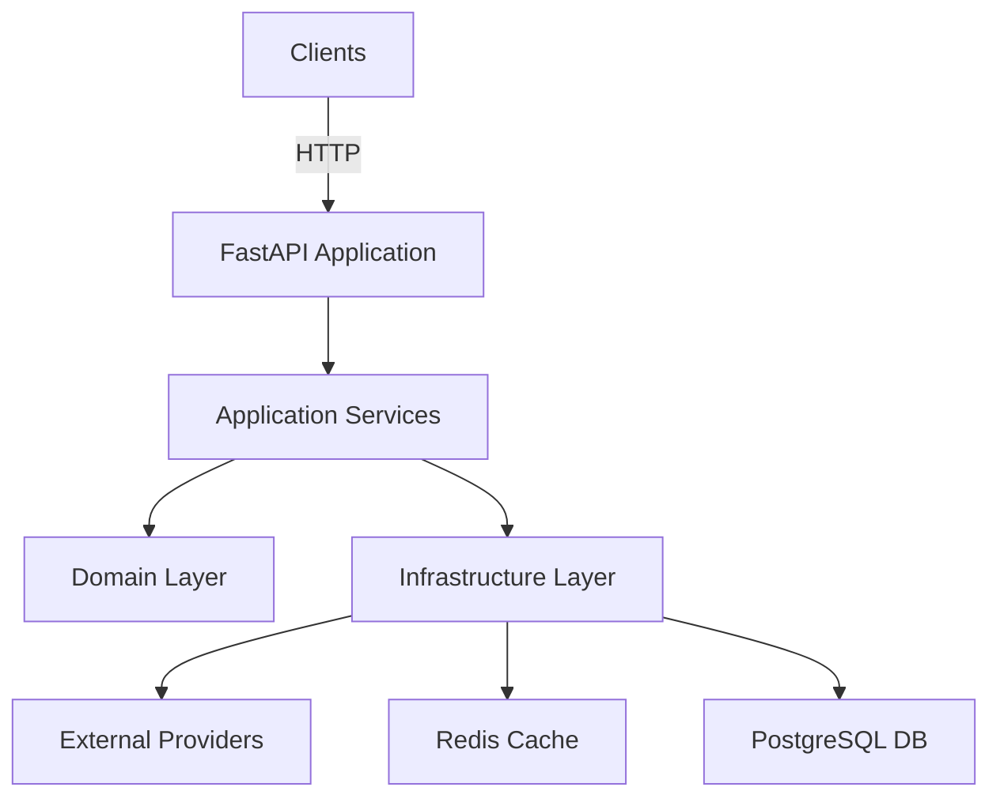

The Currency Converter API is built on a production-ready **4-layer architecture** that separates concerns, enabling maintainability and testability. The service aggregates exchange rates from three external providers (Fixer.io, OpenExchangeRates, CurrencyAPI), averages them for accuracy, caches results in Redis, and persists history in PostgreSQL.

## System overview

The API follows a strict layered approach where each layer has clearly defined responsibilities and depends only on the layer directly below it:

```
api/              ← Layer 1: HTTP interface
application/      ← Layer 2: Business logic & orchestration
domain/           ← Layer 3: Core entities & exceptions
infrastructure/   ← Layer 4: External systems (DB, cache, APIs)
```

## Component diagram



<Info>
  The architecture ensures that changing how Redis stores data never touches business logic, and swapping a currency provider only requires changes in the infrastructure layer.
</Info>

## Request flow

When you make a conversion request, the system follows this flow:

### Cache hit scenario

When a rate is already cached (within 5 minutes):

```python
GET /api/convert/USD/EUR/100
    |
    ├─ Pydantic validates path params
    ├─ ConversionService.convert() called
    │     ├─ CurrencyService.validate_currency("USD")  → Redis HIT ✓
    │     ├─ CurrencyService.validate_currency("EUR")  → Redis HIT ✓
    │     └─ RateService.get_rate("USD", "EUR")
    │           └─ Redis get_rate("USD", "EUR")        → HIT (returns cached rate)
    ├─ converted = 100 × 0.9255 = 92.55
    └─ HTTP 200 ConversionResponse
```

<Note>
  Cache hits result in **zero external API calls**, providing instant responses and reducing costs.
</Note>

### Cache miss scenario

When no cached rate exists, the system aggregates from multiple providers:

```python
GET /api/convert/USD/EUR/100
    |
    ├─ Pydantic validates path params
    ├─ ConversionService.convert() called
    │     ├─ CurrencyService.validate_currency("USD")  → Redis HIT ✓
    │     ├─ CurrencyService.validate_currency("EUR")  → Redis HIT ✓
    │     └─ RateService.get_rate("USD", "EUR")
    │           ├─ Redis get_rate("USD", "EUR")        → MISS
    │           └─ _aggregate_rates()
    │                 ├─ asyncio.gather() — parallel fetch:
    │                 │     FixerIO        → 0.9250  ✓
    │                 │     OpenExchange   → 0.9260  ✓
    │                 │     CurrencyAPI    → FAIL    ✗
    │                 ├─ avg = (0.9250 + 0.9260) / 2 = 0.9255
    │                 ├─ Redis SET rate:USD:EUR  (TTL 5 min)
    │                 └─ PostgreSQL INSERT rate_history
    ├─ converted = 100 × 0.9255 = 92.55
    └─ HTTP 200 ConversionResponse
```

From `application/services/rate_service.py:69`:

```python
async def _aggregate_rates(self, from_currency: str, to_currency: str) -> AggregatedRate:
    tasks = []
    providers = [self.primary_provider] + self.secondary_providers
    for provider in providers:
        tasks.append(self._fetch_from_provider(provider, from_currency, to_currency))

    results = await asyncio.gather(*tasks)

    rates: dict[str, Decimal] = {}
    for provider, rate in zip(providers, results, strict=False):
        if rate is not None:
            rates[provider.name] = rate

    if not rates:
        raise ProviderError(f'All providers failed for {from_currency} → {to_currency}')

    avg_rate = sum(rates.values()) / Decimal(len(rates))
```

## Dependency rules

The architecture enforces strict dependency rules:

- **API layer** imports from `application/` only
- **Application layer** imports from `domain/` and `infrastructure/`
- **Domain layer** imports nothing from other project layers (pure Python)
- **Infrastructure layer** imports from `domain/` only

<Accordion title="Why these rules matter">
  These rules ensure that:
  - Your domain logic remains framework-agnostic and easily testable
  - Infrastructure changes don't cascade through the codebase
  - Business logic stays isolated from HTTP concerns
  - You can swap databases or external APIs without touching core functionality
</Accordion>

## Key characteristics

<CardGroup cols={2}>
  <Card title="Fault tolerant" icon="shield-check">
    Continues operation even if 1-2 providers fail, averaging remaining responses
  </Card>
  <Card title="Performance optimized" icon="bolt">
    Parallel provider fetching and Redis caching minimize response times
  </Card>
  <Card title="Maintainable" icon="wrench">
    Clear separation of concerns makes changes predictable and isolated
  </Card>
  <Card title="Observable" icon="chart-line">
    Rate history in PostgreSQL enables analytics and audit trails
  </Card>
</CardGroup>

## Next steps

<CardGroup cols={2}>
  <Card title="Layer responsibilities" icon="layer-group" href="/architecture/layers">
    Learn what each layer does and how they interact
  </Card>
  <Card title="Provider strategy" icon="network-wired" href="/architecture/providers">
    Understand multi-provider aggregation and fallback logic
  </Card>
  <Card title="Caching strategy" icon="database" href="/architecture/caching-strategy">
    Explore Redis cache patterns and TTL values
  </Card>
  <Card title="Database schema" icon="table" href="/architecture/database">
    Review PostgreSQL tables and indexes
  </Card>
</CardGroup>