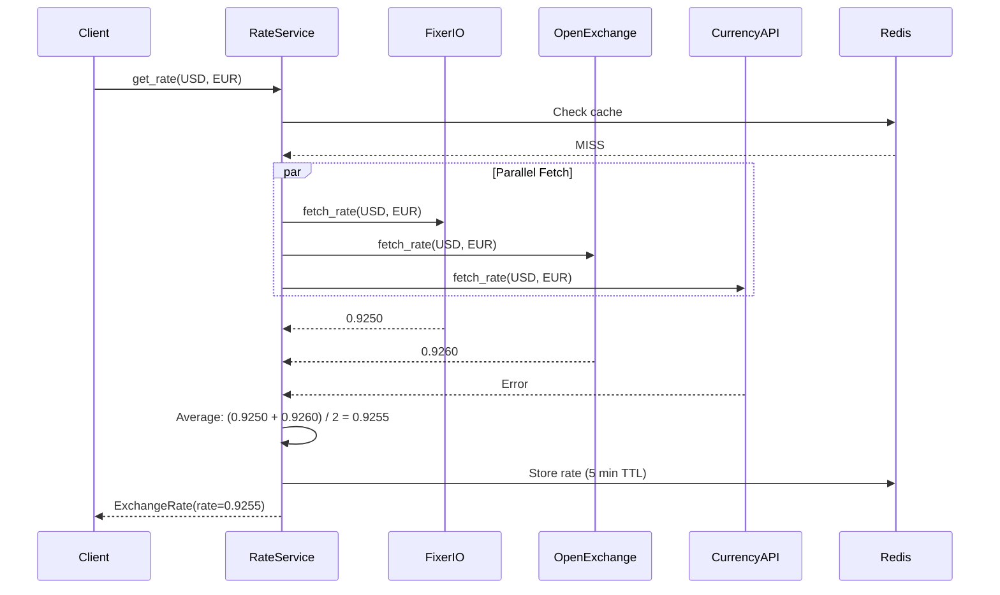

The Currency Converter API aggregates exchange rates from **three external providers** simultaneously, averages their responses for accuracy, and implements intelligent fallback logic to maintain service availability even when individual providers fail.

## Provider overview

The system integrates with three exchange rate APIs:

| Provider | Purpose | Configuration |
|----------|---------|---------------|
| **Fixer.io** | Primary provider | `FIXERIO_API_KEY` |
| **OpenExchangeRates** | Secondary provider | `OPENEXCHANGE_APP_ID` |
| **CurrencyAPI** | Secondary provider | `CURRENCYAPI_KEY` |

<Info>
  By using multiple providers, you achieve **higher accuracy** through averaging and **better reliability** through redundancy.
</Info>

## Provider protocol

All providers implement a common protocol defined in `infrastructure/providers/base.py:5`:

```python
class ExchangeRateProvider(Protocol):
    @property
    def name(self) -> str: ...

    async def fetch_rate(self, from_currency: str, to_currency: str) -> Decimal: ...

    async def fetch_supported_currencies(self) -> list[dict[str, str]]: ...

    async def close(self) -> None: ...
```

This protocol ensures consistent behavior across all providers while allowing each to implement its own API-specific logic.

## Parallel fetching strategy

When a cache miss occurs, the system fetches rates from all providers **simultaneously** using `asyncio.gather()`. This parallel approach minimizes total request time.

From `application/services/rate_service.py:69`:

```python
async def _aggregate_rates(self, from_currency: str, to_currency: str) -> AggregatedRate:
    tasks = []
    providers = [self.primary_provider] + self.secondary_providers
    for provider in providers:
        tasks.append(self._fetch_from_provider(provider, from_currency, to_currency))

    results = await asyncio.gather(*tasks)

    rates: dict[str, Decimal] = {}
    for provider, rate in zip(providers, results, strict=False):
        if rate is not None:
            rates[provider.name] = rate

    if not rates:
        raise ProviderError(f'All providers failed for {from_currency} → {to_currency}')

    avg_rate = sum(rates.values()) / Decimal(len(rates))

    return AggregatedRate(
        from_currency=from_currency,
        to_currency=to_currency,
        rate=avg_rate,
        timestamp=datetime.now(),
        sources=list(rates.keys()),
        individual_rates=rates,
    )
```

### Request flow diagram



<Note>
  The total request time equals the **slowest successful provider**, not the sum of all provider times.
</Note>

## Failure tolerance

The system continues to operate as long as **at least one provider** succeeds:

| Scenario | Behavior | Result |
|----------|----------|--------|
| All 3 providers succeed | Average all 3 rates | Highest accuracy |
| 2 providers succeed, 1 fails | Average 2 rates | Acceptable accuracy |
| 1 provider succeeds, 2 fail | Use single rate | Reduced accuracy, service continues |
| All 3 providers fail | Raise `ProviderError` | HTTP 503 Service Unavailable |

### Graceful degradation example

```
Request → [FixerIO, OpenExchange, CurrencyAPI]
            0.925      0.926        FAIL
              └──────────┘
               avg = 0.9255
```

From `application/services/rate_service.py:82`:

```python
if not rates:
    raise ProviderError(f'All providers failed for {from_currency} → {to_currency}')

avg_rate = sum(rates.values()) / Decimal(len(rates))
```

<Info>
  Failed providers are **silently excluded** from the average. Only when all providers fail does the service return an error.
</Info>

## Retry logic

Each provider fetch attempt includes automatic retry logic using the **tenacity** library.

From `application/services/rate_service.py:55`:

```python
@retry(
    stop=stop_after_attempt(3),
    wait=wait_exponential(multiplier=1, min=1, max=10),
    retry=retry_if_exception_type((ConnectionError, TimeoutError)),
)
async def _fetch_from_provider(
    self, provider: ExchangeRateProvider, from_currency: str, to_currency: str
) -> Decimal | None:
    try:
        return await provider.fetch_rate(from_currency, to_currency)
    except Exception as e:
        logger.error(f'Provider {provider.name} failed: {e}')
        return None
```

### Retry configuration

| Parameter | Value | Meaning |
|-----------|-------|----------|
| **Attempts** | 3 | Maximum number of tries per provider |
| **Backoff** | Exponential | Wait times: 1s → 2s → 4s |
| **Max wait** | 10 seconds | Cap on backoff duration |
| **Retry conditions** | `ConnectionError`, `TimeoutError` | Only retry network-level failures |
| **No retry** | `ProviderError` | API-level errors are not retried |

<Accordion title="Why not retry ProviderError?">
  `ProviderError` indicates an API-level problem (invalid API key, malformed request, rate limit exceeded). Retrying these errors would waste time since they won't succeed without external intervention.

  Network errors (`ConnectionError`, `TimeoutError`) are transient and often succeed on retry.
</Accordion>

## Provider implementation example

Each provider implements the protocol with its own API-specific logic. Here's the Fixer.io implementation from `infrastructure/providers/fixerio.py:8`:

```python
class FixerIOProvider:
    BASE_URL = 'http://data.fixer.io/api'

    def __init__(self, api_key: str, client: httpx.AsyncClient | None = None, timeout: int = 10):
        self.api_key = api_key
        self._client = client or httpx.AsyncClient(timeout=timeout)

    @property
    def name(self) -> str:
        return 'fixerio'

    async def _request(self, endpoint: str, params: dict) -> dict:
        params['access_key'] = self.api_key
        url = f'{self.BASE_URL}/{endpoint}'

        try:
            response = await self._client.get(url, params=params)
            response.raise_for_status()
            data = response.json()

            if not data.get('success', False):
                info = data.get('error', {}).get('info', 'Unknown error')
                raise ProviderError(f'Fixer.io API error: {info}')

            return data

        except httpx.HTTPStatusError as e:
            raise ProviderError(
                f'Fixer.io HTTP error {e.response.status_code}: {e.response.text[:200]}'
            ) from e
        except httpx.RequestError as e:
            raise ProviderError(f'Fixer.io request failed: {e.__class__.__name__}') from e
        except Exception as e:
            raise ProviderError(f'Fixer.io response parsing error: {str(e)}') from e

    async def fetch_rate(self, from_currency: str, to_currency: str) -> Decimal:
        data = await self._request('latest', {'base': from_currency, 'symbols': to_currency})
        try:
            return Decimal(str(data['rates'][to_currency]))
        except KeyError as e:
            raise ProviderError(f'Missing rate for {to_currency}') from e

    async def fetch_supported_currencies(self) -> list[dict]:
        data = await self._request('symbols', {})
        return [{'code': code, 'name': name} for code, name in data['symbols'].items()]

    async def close(self) -> None:
        await self._client.aclose()
```

<Note>
  Each provider owns its own `httpx.AsyncClient` and translates API-specific errors into domain exceptions (`ProviderError`). This isolation makes testing trivial through dependency injection.
</Note>

## Provider initialization

Providers are initialized at application startup and stored as singletons. From `api/dependencies.py:36`:

```python
def init_dependencies() -> None:
    """Initialize all singleton dependencies. Called at app startup."""
    logger.info('Initializing dependencies...')
    settings = get_settings()

    deps.db = Database(settings.DATABASE_URL)
    deps.redis_client = Redis.from_url(settings.REDIS_URL, decode_responses=True)
    deps.redis_cache = RedisCacheService(deps.redis_client)

    deps.providers = {
        'fixerio': FixerIOProvider(settings.FIXERIO_API_KEY),
        'openexchange': OpenExchangeProvider(settings.OPENEXCHANGE_APP_ID),
        'currencyapi': CurrencyAPIProvider(settings.CURRENCYAPI_KEY),
    }
    logger.info('Dependencies initialized')
```

## Supported currency initialization

At startup, the system fetches supported currencies from all providers and computes their **intersection** — only currencies supported by all providers are added to the database.

From `application/services/currency_service.py:17`:

```python
async def initialize_supported_currencies(self) -> None:
    logger.info('Initializing supported currencies...')

    provider_tasks = [provider.fetch_supported_currencies() for provider in self.providers]
    results = await asyncio.gather(*provider_tasks, return_exceptions=True)

    all_currencies = []
    for i, result in enumerate(results):
        provider_name = self.providers[i].name
        if isinstance(result, Exception):
            logger.error(f'Failed to fetch currencies from {provider_name}: {result}')
        elif isinstance(result, list):
            all_currencies.append(set(c['code'] for c in result))
            logger.info(f'{provider_name} supports {len(result)} currencies')

    if not all_currencies:
        raise ProviderError('Failed to fetch currencies from any provider')

    supported_codes = set.intersection(*all_currencies)
    currency_models = [SupportedCurrency(code=code, name=None) for code in supported_codes]

    await self.repository.save_supported_currencies(currency_models)
    logger.info(f'Saved {len(supported_codes)} supported currencies.')
```

<Accordion title="Why use intersection instead of union?">
  Using the **intersection** ensures that any currency pair can be converted using any provider. If you used the union, some conversions might only work with specific providers, creating inconsistent behavior.

  This design prioritizes **reliability** over **coverage**.
</Accordion>

## Error handling

Provider errors are mapped to HTTP status codes via exception handlers. Domain exceptions raised by providers propagate up through the application layer and are caught at the API layer.

| Exception | HTTP Status | Client Message |
|-----------|-------------|----------------|
| `ProviderError` | 503 | "Exchange rate service unavailable" |
| `InvalidCurrencyError` | 400 | "Currency XYZ not supported" |
| `CacheError` | 500 | "Internal server error" |

<Warning>
  `ProviderError` messages are **never exposed** to clients. They may contain internal API details like error codes or provider-specific information.
</Warning>

## Adding a new provider

To add a new exchange rate provider:

1. **Create provider class** implementing `ExchangeRateProvider` protocol
2. **Add configuration** for API key/credentials to `config/settings.py`
3. **Initialize provider** in `api/dependencies.py:init_dependencies()`
4. **Update rate service** to include the new provider in `get_rate_service()`

```python
# Example: Adding a fourth provider
deps.providers = {
    'fixerio': FixerIOProvider(settings.FIXERIO_API_KEY),
    'openexchange': OpenExchangeProvider(settings.OPENEXCHANGE_APP_ID),
    'currencyapi': CurrencyAPIProvider(settings.CURRENCYAPI_KEY),
    'newprovider': NewProvider(settings.NEW_PROVIDER_KEY),  # Add here
}
```

No changes needed to business logic or domain models.

## Performance characteristics

<CardGroup cols={2}>
  <Card title="Parallel execution" icon="bolt">
    Response time equals the slowest provider, not the sum of all providers
  </Card>
  <Card title="Automatic retry" icon="rotate-right">
    Exponential backoff handles transient network failures gracefully
  </Card>
  <Card title="Fault tolerance" icon="shield">
    Service continues with 1+ working providers, degrades gracefully
  </Card>
  <Card title="Rate averaging" icon="chart-line">
    Multiple sources increase accuracy and reduce outlier impact
  </Card>
</CardGroup>